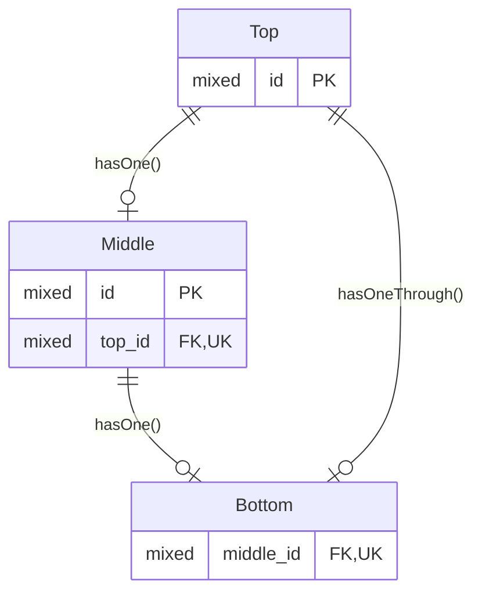

# Has One Through

## Forward Relationship

### ER Diagram



### Relationship Method

```php
<?php

use Illuminate\Database\Eloquent\Relations\HasOneThrough;
use Illuminate\Database\Eloquent\Relations\HasOne;

/** @property Bottom|null $bottom */
/** @property Middle|null $middle */
class Top extends Model
{
    public function bottom(): HasOneThrough
    {
        return $this->hasOneThrough(Bottom::class, Middle::class);
    }

    // Alternative, with optional hasOne() methods present
    public function bottom(): HasOneThrough
    {
        return $this->through('middle')->has('bottom');
    }

// Optional
    public function middle(): HasOne
    {
        return $this->hasOne(Middle::class);
    }
}
```

```php
<?php

use Illuminate\Database\Eloquent\Relations\HasOne;

/** @property Bottom|null $bottom */
class Middle extends Model
{
    // Optional
    public function bottom(): HasOne
    {
        return $this->hasOne(Bottom::class);
    }
}
```

### Notes

With the two `hasOne` relationships in place, `$top->bottom` seems to be equivalent to `$top->middle?->bottom`.

The Laravel docs start by describing the Top/Middle relationship as a one-to-one, then follow up with a fluent example that implies it is a one-to-many. I need to try this out to see how it really works, because I suspect there is something I am misunderstanding.
