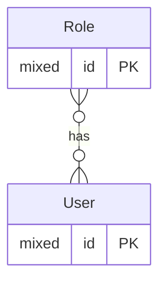
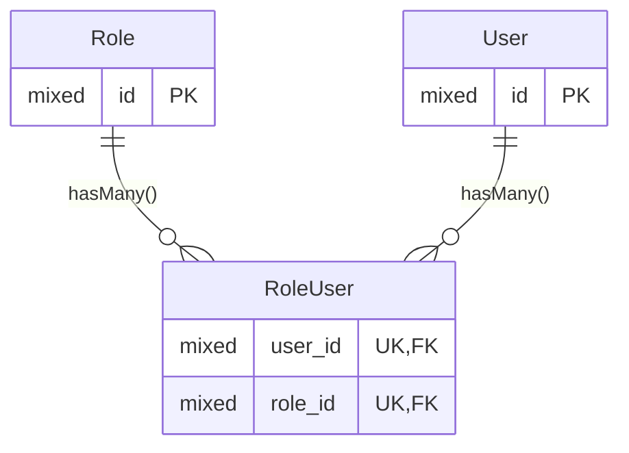

# Many to Many

## Forward Relationship

### ER Diagram



**The implied relationship.**

In the following example, each `User` can be related to each `Role` once.
This is what you would expect for a roles and users; a user each has a role or does not.
The unique key on the pivot table (`RoleUser`) enforces this.

When the pivot table contains additional metadata that puts context onto the relationship,
then the two sides of the many-to-many relationship may not need this restriction,
and then no unique index is used on the pivot table.

An example of this could be a lending library,
where a member is able to borrow the same title multiple times,
but each would have their own return date based on when they were loaned.
(probably a bad example, as you may be blocked from doing this in a real library)



**The implementation with a pivot table (`RoleUser`).**

### Relationship Method

```php
<?php

use Illuminate\Database\Eloquent\Collection;
use Illuminate\Database\Eloquent\Relations\BelongsToMany;

/** @property Collection<Role> $roles */
class User extends Model
{
    public function roles(): BelongsToMany
    {
        return $this->belongsToMany(Role::class);
    }
}
```

```php
<?php

use Illuminate\Database\Eloquent\Collection;
use Illuminate\Database\Eloquent\Relations\BelongsToMany;

/** @property Collection<User> $users */
class Role extends Model
{
    public function users(): BelongsToMany
    {
        return $this->belongsToMany(User::class);
    }
}
```
