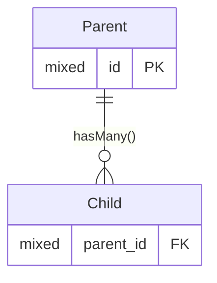
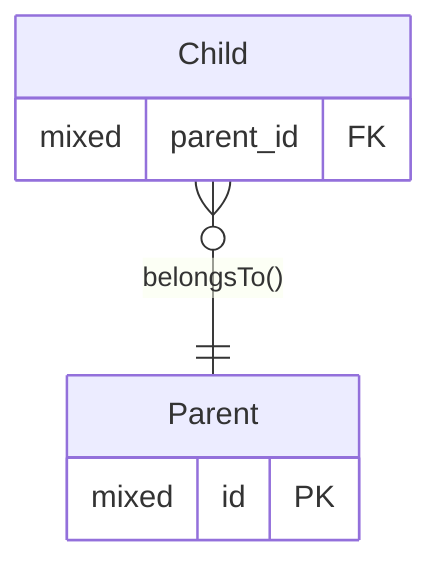

# One-to-many

* A column type of `mixed` will generally be a big [unsigned] integer,
  or a string holding a UUID.
  So long as they are consistent between the entities,
  they either will work.
* The `id` column is the default that Laravel uses for the primary key.
  Any name can be used, for example `uuid` to make it clear what data type
  the primary key uses.
  The foreign keys would be named appropriately in this case, for example `parent_uuid`.

## Forward Relationship

### ER Diagram



### Relationship Method

```php
<?php

use Illuminate\Database\Eloquent\Collection;
use Illuminate\Database\Eloquent\Relations\HasMany;

/** @property Collection<Child> $child */
class Parent extends Model
{
    public function children(): HasMany
    {
        return $this->hasMany(Child::class);
    }
}
```

## Inverse Relationship

### Inverse ER Diagram



### Inverse Relationship Method

```php
<?php

use Illuminate\Database\Eloquent\Relations\BelongsTo;

/** @property Parent $parent */
class Child extends Model
{
    public function parent(): BelongsTo
    {
        // The second parameter can be omitted if the first part
        // is the same as this method name, as it is here.

        return $this->belongsTo(Parent::class, 'parent_id');
    }
}
```

### Variations

* The relationship back to the parent may be optional.
* The `BelongsTo` method name is used to derive the foreign key column name.
